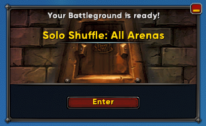
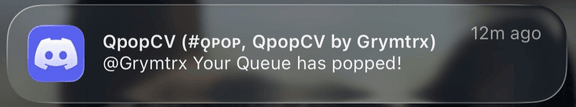

# QPopCV

A Windows desktop app that detects WoW Solo Shuffle & Blitz queue pops via screen capture and sends a Discord notification to your phone.





## Features

- **Queue pop detection** — using your reference image, computer image detects Queue pop.
- **Discord Mobile notifications** — instant ping with ~1s end-to-end latency
- **AFK notification** — Discord ping reminders that youre nearing blizzards auto-logout time.
- **Discord process detection** — warns if Discord desktop is running (Mobile Notification result from PC discord.exe not running)
- **Auto-update** — checks for new releases on launch with SHA-256 zip verification

## Requirements

- Windows 10+
- Python 3.11+ (tested on 3.14)
- A Discord webhook URL and your Discord user ID
- WoW open with the queue pop visible on screen

## Setup

Download the latest release or clone the repo and install dependencies:

```
pip install -r requirements.txt
python main.py
```

For setup help and community support:
**[QPopCV Discord](https://discord.gg/KpupS6N3Zj)**

## How It Works

QPopCV captures a region of your screen and runs OpenCV template matching against known queue pop images. When a match exceeds the confidence threshold, it fires a Discord webhook mentioning your user ID. The entire pipeline — capture, match, notify — completes in under a second.

## TOS Compliance

QPopCV operates within Blizzard's Terms of Service:

- **No memory reading/writing** — never touches WoW's process, RAM, or network
- **No automation** — observes the screen only; does not click, accept queues, or act in-game
- **No injected code** — standalone desktop app, no DLLs or addons
- **Standard screen capture** — same APIs used by OBS, Discord screen-share, and Windows Magnifier

> **Disclaimer:** While QPopCV is designed to comply with Blizzard's policies, use is at your own discretion.

## License

See [LICENSE](LICENSE) for details.
